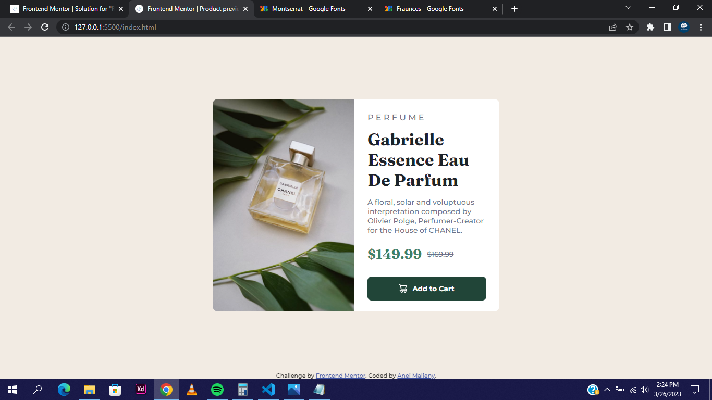

# Frontend Mentor - Product preview card component solution

This is a solution to the [Product preview card component challenge on Frontend Mentor](https://www.frontendmentor.io/challenges/product-preview-card-component-GO7UmttRfa). Frontend Mentor challenges help you improve your coding skills by building realistic projects. 

## Table of contents

- [Overview](#overview)
  - [The challenge](#the-challenge)
  - [Screenshot](#screenshot)
  - [Links](#links)
- [My process](#my-process)
  - [Built with](#built-with)
  - [What I learned](#what-i-learned)
  - [Continued development](#continued-development)
  - [Useful resources](#useful-resources)
- [Author](#author)

## Overview
I'm proud to say I set a goal of finishing this in two hours and I was able to achieve that. I know everything isn't as perfect but I atleast delivered.

### The challenge

Users should be able to:

- View the optimal layout depending on their device's screen size
- See hover and focus states for interactive elements

### Screenshot

### Links

- Solution URL: [Add solution URL here](https://your-solution-url.com)
- Live Site URL: [Add live site URL here](https://your-live-site-url.com)

## My process

### Built with

- Semantic HTML5 markup
- CSS custom properties
- Flexbox
- CSS Grid
- Web-first workflow

### What I learned

In my previous two challenges of FrontEnd mentor, I was using flexbox and margin to centre the component but in this project I was able to try out the 'Grid' style to centre the component. I will definitely be learning more about it.

### Continued development

 - I want to be learn more responsive design because I'm having some challenges but in the future projects I'm confident there will be improvement.

 - I would also love to learn more about CSS Grid and flexbox.

### Useful resources

- [CSS Tricks](https://css-tricks.com/) - This helped me with the grid css trick and I recommend it to anyone trying to be perfect at CSS. They have everything you will ever need.

## Author

- Website - [Anei Malieny](https://www.linktr.ee/djgenuis)
- Frontend Mentor - [@aneimalieny](https://www.frontendmentor.io/profile/aneimalieny)
- Twitter - [@sickomody](https://www.twitter.com/sickomody)
